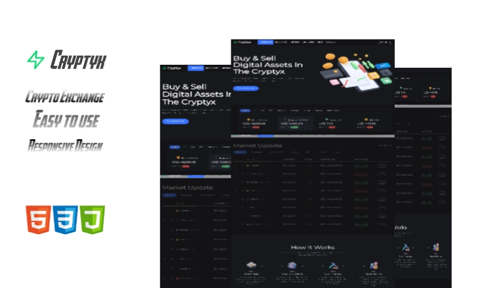

<div align="center">

  <h2 align="center">Cryptyx - Cryptocurrency Exchange Website</h2>

  Cryptyx is a fully responsive cryptocurrency exchange website, <br />Responsive for all devices, build using HTML, CSS, and JavaScript.

  <a href="https://cryptyx-exchange.netlify.app/"><strong>➥ Live Demo</strong></a>

</div>

<br />


### Thumbnail




### Prerequisites

Before you begin, ensure you have met the following requirements:

* [Git](https://git-scm.com/downloads "Download Git") must be installed on your operating system.

### Run Locally

To run **Cryptyx** locally, run this command on your git bash:

Linux and macOS:

```bash
sudo git clone https://github.com/SamuelPaschalson/Crypto-Exchange-Website.git
```

Windows:

```bash
git clone https://github.com/SamuelPaschalson/Crypto-Exchange-Website.git
```

### Contact

If you want to contact with me you can reach me at [WhatsApp](https://wa.me/2348182540860?text=Hi%20am%20)
